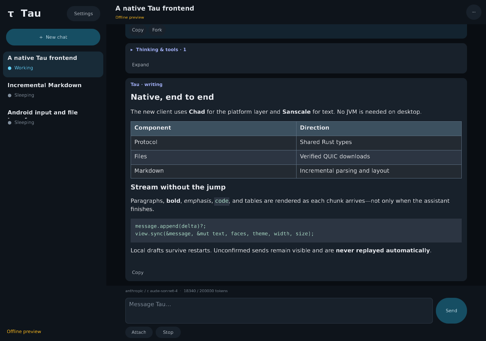
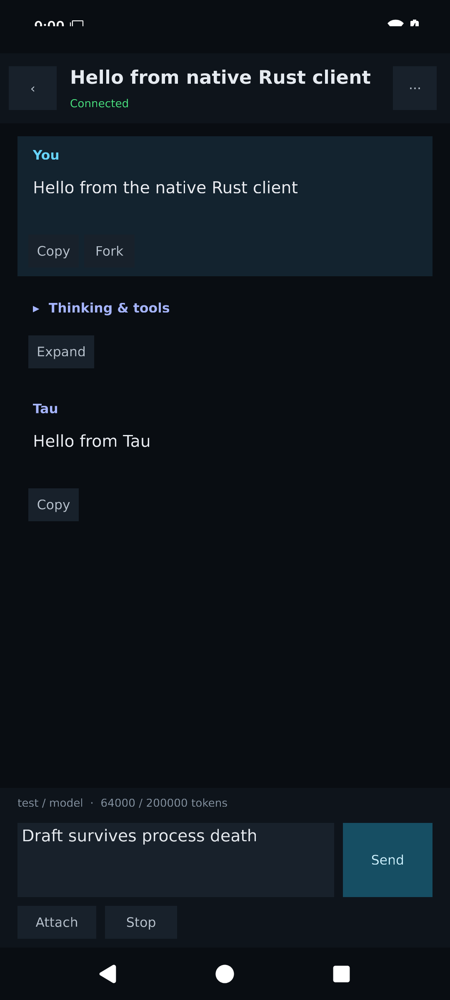

# Tau 2 · native Rust frontend

Branch: `tau2/rust-frontend`. This is a working **preview**, not a production
replacement installer. `app/` remains the Kotlin reference; this branch does not
modify, uninstall, migrate, or deploy over the existing client/service.

The UI, retained transcript, local work, protocol, HTTP/WebSocket transport,
Markdown and file transfer are Rust. Chad owns the window/surface lifecycle;
Sanscale owns text. Android has a small Java **OS bridge**, not Kotlin/Compose:
IME editing, clipboard, document grants, insets and task Back.

<p>
  
  
</p>

## Run / build

The beta uses a red-trim Tau icon and the desktop title/executable **Tau Beta**;
the in-app theme is unchanged. It runs alongside stable Tau: Windows uses a
separate taskbar identity (`app.tau.beta`) and portable executable, and Android
keeps its separate package (`app.tau.rust`). No stable installer, updater or
registration is touched. Local state remains in `%LOCALAPPDATA%\Tau2` (or
`$XDG_DATA_HOME/Tau2`), preserving settings from the earlier Rust preview but
not sharing stable Tau's data. Both clients still operate on the **same remote
chats** when configured for the same daemon.

From the repository root, using the host's normal managed Cargo wrapper:

```sh
cargo run --locked -p tau-frontend --bin tau
ANDROID_ABI=arm64-v8a frontend/android/build.sh
ANDROID_ABI=x86_64 frontend/android/build.sh   # emulator
scripts/build-rust-windows.sh                # Linux + cargo-xwin
```

Android: SDK 35, build tools 35.0.0, NDK 27.2.12479018, Java, Python 3 and the
corresponding Rust target. API 29+, Vulkan 1.1. APKs are development-signed and
16 KB aligned, under `target/android/<abi>/tau-frontend-<abi>.apk`. The separate
package `app.tau.rust` is labeled **Tau Beta**. Only Internet permission is
requested; files use the system document picker. Plain HTTP is supported for
Tailnet/loopback setups, just as in the existing client—not for public networks.

Windows: native x64 portable `dist/tau-beta-windows-x64/Tau Beta.exe`. No JVM or UniFFI
runtime. Static CRT is selected in `.cargo/config.toml`; Windows system libraries
are still required. The old Compose self-extractor is deliberately unchanged. Windows resource
embedding uses `llvm-rc` when cross-building, or the Windows SDK on Windows.

Desktop input explicitly calls `ctx.request_redraw()` after UI mutations;
Chad's desktop on-demand runner does not implicitly redraw on input. Network
and picker completions use its `Waker`. Hover/press state and native cursors
are updated without switching to continuous rendering.

Icon source: `frontend/assets/tau-beta.svg`. Regenerate its PNG/ICO launcher
assets with `python3 frontend/assets/generate-icons.py` (`rsvg-convert` required).

Use Settings to enter the URL and token. Desktop automation can explicitly set
`TAU2_SERVER` and `TAU2_TOKEN`; these override and save the settings. Do not put
credentials in command-line arguments or screenshots. `TAU2_DATA_DIR` overrides
private desktop storage (default `$XDG_DATA_HOME/Tau2`, `~/.local/share/Tau2`, or
`%LOCALAPPDATA%\Tau2`). Android uses its own private files directory. Tokens and
local drafts are in private SQLite, not an OS credential vault.

## Included

- Responsive chat list / transcript / composer, familiar dark Tau palette.
- Create/reuse starter, real model/context counts, rename, clone, fork at a user
  message, sleep worker, confirmed permanent deletion, unread metadata.
- Streaming text and Markdown on every update, not on completion; tables, code,
  inline styles; collapsible thinking/tools across history-page boundaries.
- Mouse text selection within a message; projected-text copy and whole-message
  source copy. Authored Markdown links require confirmation and allow only
  HTTP, HTTPS and mailto. Android long-press selects a whole message for copy.
- Enter to send, Shift+Enter newline, Escape to interrupt, composer selection,
  clipboard text/images, undo/redo, dropped files and system file pickers on
  desktop. Android uses a native **editing dialog** for robust IME composition,
  selection, autocorrection and paste; Done returns to the Rust composer.
- Daemon slash-command and argument completion, extension dialogs, notices,
  status and widgets, and exact shared title-prompt editing (including empty).
- Durable pending sends/controls; edit/delete queued requests, inclusive prefix
  execution, resume and control cancellation. No reconnect/restart replay.
- Account/chat-scoped verified, resumable Iroh downloads, progress/cancellation,
  inline saved images, full-screen pan/pinch/wheel/fit, export of saved originals.
  No TCP fallback or Kotlin transfer bindings in native builds.
- Memory-only remote history; SQLite WAL/FULL local work and private file copies.
  Loads older pages without starting a worker; bounded recent-chat warming;
  stable scroll anchors/follow-tail across stream changes and chat switches.
- On-demand rendering with network wakeups; bounded queues and transfer concurrency.

## Code map

- `controller.rs`: local-first actions, receipt reconciliation and session feeds.
- `feed.rs`: transactional generation/sequence/order validation and history windows.
- `store.rs`: local-only SQLite state and private attachment paths.
- `transport.rs`: authenticated, epoch-scoped sockets, heartbeat/reconnect, HTTP
  grants/uploads and direct `tau-transfer` calls. No token-bearing error logging.
- `app.rs`: screens, presentation grouping, hit targets, scroll/selection, actions.
- `editor.rs`, `render.rs`: input state, Sanscale, incremental Markdown and GPU media.
- `desktop.rs`, `android.rs`, `android/java/`: platform services and event adapters.
- `../protocol/`: single Rust wire definition consumed by client and daemon.
- `../markdown/`: extracted companion component, with upstream provenance/licenses.

See [MERGE.md](MERGE.md) before combining the independent backend conversion.

## Verification

```sh
cargo nextest run --workspace
cargo clippy -p tau-frontend --no-deps --all-targets -- -D warnings
cargo run --locked -p tau-frontend --bin tau -- --screenshot /tmp/tau-desktop.png
cargo run --locked -p tau-frontend --bin tau -- --screenshot /tmp/tau-phone.png --phone
```

Screenshot mode is an explicit offline fixture with an isolated temporary store;
it never connects to or reads the user's account.

Verified: **51 workspace tests passed**, client Clippy passed, both APKs built and
signature/alignment-verified, and the Windows static-CRT cross-build succeeded.
The Windows linker reports missing optional Microsoft debug PDBs (LNK4099); its
imports were checked and do not require `VCRUNTIME140.dll`.

The small frontend suite exercises the **production controller and transport**:
real `taud` + its existing deterministic Pi subprocess fixture for chat creation,
queue edit/delete, abort, upload, extension response, title settings, fork and
restart; an authenticated HTTP-grant → native QUIC → offline-cache round trip;
a socket dropped after receiving a prompt but before acknowledging it, durable
restart without replay and reconciliation by request ID; incompatible protocol,
stale socket epoch, malformed/gapped updates and stale/colliding history pages.
The inherited daemon/transfer tests remain; the Markdown suite retains the useful
prefix/edit differential and incremental-work regressions. One added Markdown
regression covers link-destination edits and projected selection/copy.

### Manual acceptance recorded for this branch

- Linux Vulkan headless desktop/phone rendering inspected.
- Android ARM64 and x86_64 release libraries/APKs built; signatures/alignment checked.
- Dedicated API 36 x86_64 Vulkan emulator: installed alongside the old app, entered
  connection settings via IME, created chat, sent to the isolated fixture daemon,
  received transcript, force-stopped **while editing before Done**, reopened and
  verified the draft plus fetched history survived. No production daemon touched.
- Windows x64 cross-build. A real Windows device acceptance run is still needed.

## Remaining release gates / deliberate preview differences

This branch is **not** a claim of complete production parity:

1. Merge the backend and settle its durable-ack contract. Do not remove uncertain
   delivery state before that guarantee exists. Re-run the end-to-end suite.
2. Keep the old app until explicit migration of its SQLite drafts/pending work and
   cached files, production Android package/signing, and native Windows installer
   integration are done. This preview intentionally uses separate storage/package.
3. Chad's documented winit Activity Destroy/recreation bugs remain. Root Back
   backgrounds; ordinary resume is not evidence that actual Activity destruction
   and same-process recreation work. Do not mask this with `process::exit`.
4. Native accessibility/semantic trees, cross-message selection, Android selection
   handles, and fully inline Android IME editing remain follow-up work. Modal
   input is functional but is a visible sidegrade from Compose.
5. Very large extension menus, extension timeout presentation, keyboard-navigation
   polish, and model-failure/tool-call presentation beyond the current grouping
   need further parity/physical-device acceptance. The context display is counts,
   not the original circular indicator. Sanitized remote crash uploads have not
   been ported; Android retains a bounded private local panic trace.
6. Long-session memory/performance and large-image/file-picker/export behavior need
   device soak testing. The Markdown dialect is explicitly not full CommonMark;
   see the companion's dialect notes. Image decoding is bounded but currently
   happens on the UI thread on first view. This is not a zero-copy UI claim.
