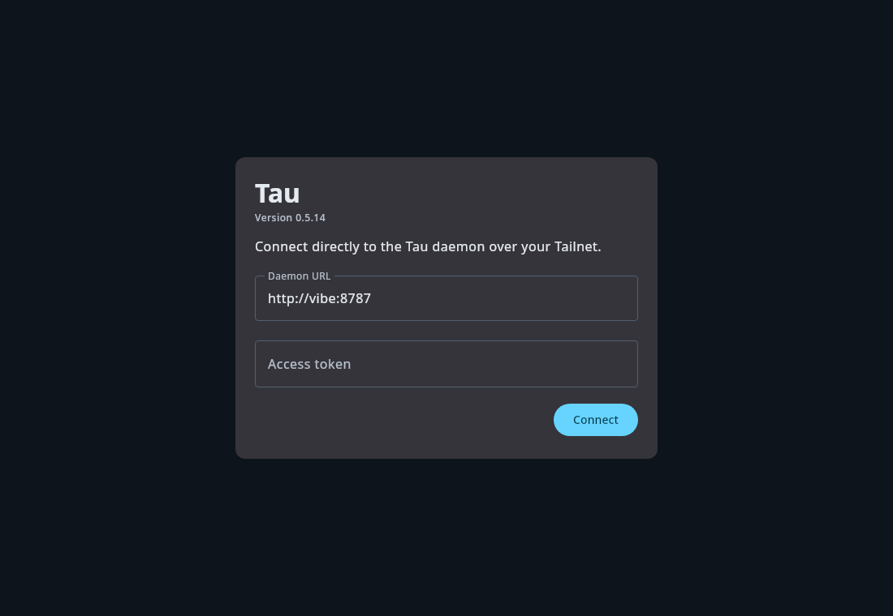
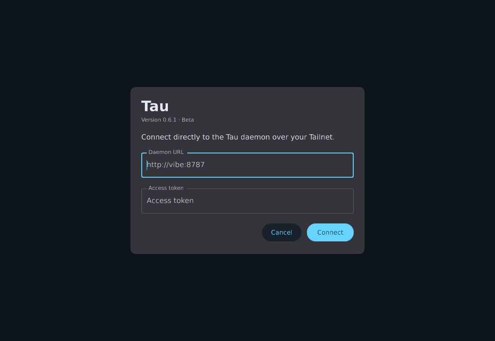
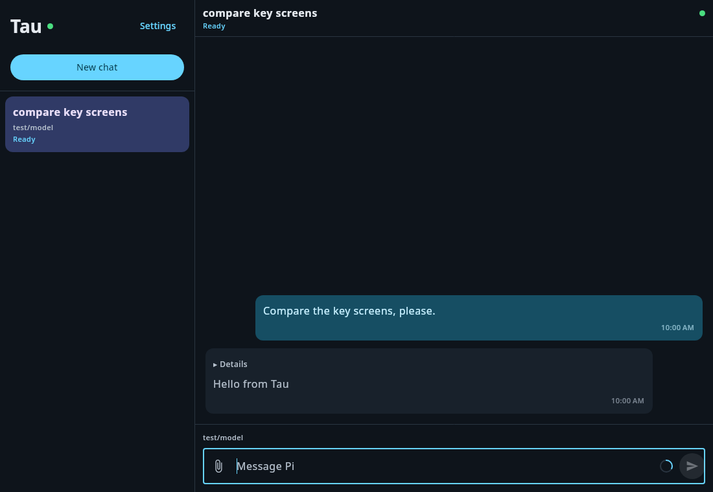
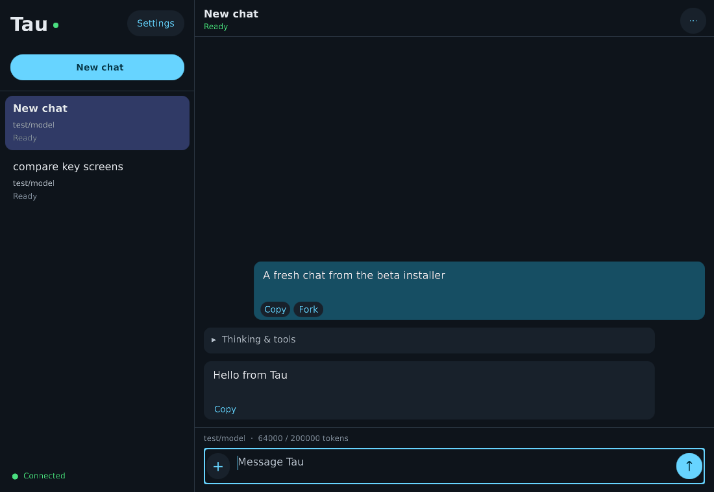

# 0.6.1 UI / installer acceptance

Manual checks, not new tests of basic event API usage. All data/credentials below
are synthetic. No production daemon, stable installation or user chat was modified.

## Comparison

Ran the existing Kotlin Tau 0.5.14 desktop client and the native frontend against
the same isolated, real protocol-10 `taud` using its deterministic Pi fixture.
Compared settings, the session list, empty pane, new chat and completed replies.

| Existing Tau | Native beta |
| --- | --- |
|  |  |
|  |  |

The native screenshots here are the **installed Windows binary under Wine**;
Kotlin ran on Linux. Different messages/selection are shown, not a pixel golden.
OS UI fonts are used when available (Segoe UI/Noto/Roboto), with bundled fallbacks.

Adjusted: 520dp settings card, 16dp single-line field text, 56dp outlined fields
with vertically centered text, floating labels, matching colours and primary
buttons, 300dp sidebar, readable model/status metadata, compact outlined composer,
role-aligned bubbles, and bottom-aligned short conversations. The empty pane
remains blank as requested. Some native controls/presentation remain sidegrades;
this is not a claim of pixel-for-pixel parity.

## Interactive journeys checked

- Fresh setup: enter URL and token through the UI, Tab between fields, Enter to
  connect. Invalid URL produces an inline error without losing field contents.
- Wrong token: HTTP 401 is visible, not an indefinite silent reconnect. Correct
  the token and retry; form closes after successful authenticated protocol hello.
- Paste URL/token with trailing line endings/spaces; saved token is normalized.
- Long single-line fields scroll horizontally and masked token caret/selection
  use the same projected text as painting.
- Create a new chat using the button, type a message, send, receive the daemon's
  transcript, and see it from the original Tau client too.
- Load the title prompt, edit/save it, reopen and confirm the daemon's saved value.
- Retain an unsent draft across installer update and client relaunch.

The Windows run also caught a text-routing bug: the adapter treated **every**
named key as an editing command and discarded its produced text. Only editing
commands are intercepted now; other keys use `KeyEvent.text`. Typing the entire
URL and `Hello p8888 from installed beta` was checked after that correction.

## Installer journey checked

Isolated Wine prefix, Vulkan renderer:

1. Fresh `Tau-Beta-0.6.1-windows-x64.exe --quiet --no-launch` install.
2. Launch through the installed Start Menu `Tau Beta.exe` dispatcher.
3. Install a changed payload while an earlier beta is open; active version changes
   atomically, older version remains, local draft/settings survive relaunch.
4. Delete only the beta Start Menu entry, run setup again, confirm repair.
5. Hash-check synthetic stable `Tau.exe`, stable data, and stable Start Menu entry:
   all unchanged after install/update/repair.

Both Android ABIs still build and signature/alignment checks pass. Existing
51 workspace tests and 4 Windows launcher tests pass. A physical Windows run,
including its usual DirectX backend and display scaling, remains necessary;
Wine is not a substitute for that platform acceptance.
