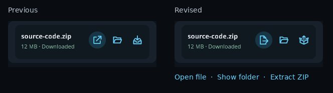
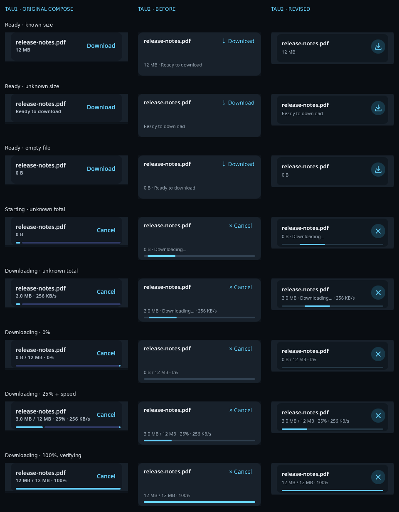
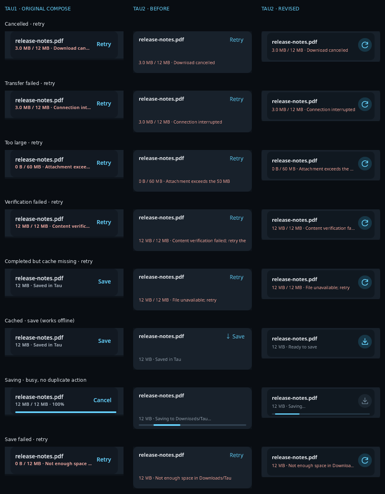
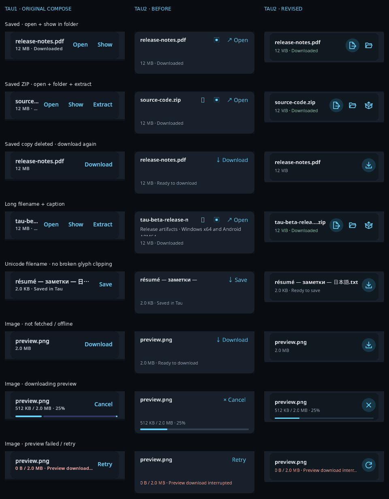
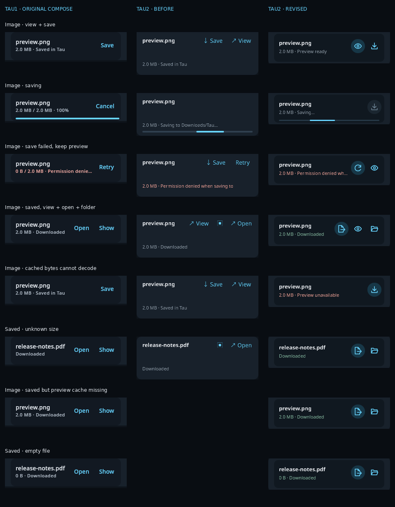

# Inline download controls — September 27, 2026

## Design and scope

The transcript and Attachments pane use **one renderer and one height calculation**.
The control itself is 68dp high (Tau1's height), with no reserved empty caption row.
Download/save, view, open, cancel, retry, folder and ZIP extraction are native vector
paths, not Unicode stand-ins or text buttons. A tonal primary action and quieter
secondary actions have 40dp desktop / 44dp touch hit targets. Saved files get a quiet
green status; failures retain the error and retry action; saving is visibly busy and
cannot enqueue a duplicate export.

Following icon-readability feedback, **Open** uses a folded document opening to the
right instead of an external-link square. **Extract** uses an open carton with
contents coming out, not a download-like arrow into a tray. Folder remains unchanged,
so the three saved-ZIP actions have different silhouettes. Hover/hold labels remain.



Names and status are shaped as **single lines** with real ellipsis, never clipped
wrapped text. Long filenames retain their extension. The full name/status/caption
is available by hovering or tapping the text; icons have descriptive hover labels
and touch-and-hold labels without performing the action. Chat and sidebar instances
of the same file have distinct tooltip anchors, including during progress updates.

Images are centered, keep their reserved preview area, and show explicit loading,
failure and undecodable-image placeholders. Undecodable cached images can still be
saved, but do not offer a misleading View action. Save failure preserves a usable
preview. Cache completion is not advertised as an OS download: **Ready to save** or
**Preview ready** is distinct from **Downloaded**.

The audit also fixed cached non-image Save using the 10 MB image limit instead of
its 50 MB file limit, and cleared stale save errors when a retry starts transferring.
Private-cache verification, scoped saved-file records, collision-safe OS saves,
missing-file recovery and ZIP extraction safety are preserved.

Scope: inline controls in chat and the Attachments pane. This does not redesign the
full-screen image viewer's zoom/Back toolbar or introduce new keyboard/screen-reader
infrastructure. Android intentionally has no desktop folder/extract actions.

## State inventory and renders

`cases.json` covers all seven primary controls (`Download`, `Save`, `View`, `Open`,
`Cancel`, `Retry`, `Busy`) and all conditional secondary controls. Its **32 cases**:

- Ready with known, unknown and zero size; starting/unknown-total transfers;
  0%, partial with speed, and 100% awaiting completion.
- Cancelled, interrupted, too large, integrity failure, completed-but-missing cache.
- Cached/offline save, saving, OS save failure, saved file, saved ZIP, deleted saved
  copy, long name/caption, Unicode, saved unknown/zero size.
- Image not fetched/offline, fetching, failed, cached view/save, saving, save failure,
  saved with preview, undecodable cache and saved with missing preview cache.

Each case is rendered at four physical/logical profiles:

| Profile | Surface width | Scale | Input/platform affordances |
| --- | ---: | ---: | --- |
| Desktop | 552px | 1× | Desktop |
| Narrow attachment sidebar | 320px | 1× | Desktop |
| Phone | 360px | 1× | Touch/Android |
| Scaled phone | 900px (360dp) | 2.5× | Touch/Android |

Every applicable Tau2 icon additionally renders **hover, pressed, tooltip, and
partially scrolled-out/clipped** states. Saving includes the disabled/no-op control.
Tests assert single-line measured text, no text/action overlap, correct action
counts, full target dimensions, clipping and tooltip containment. Actual desktop
chat + sidebar and phone chat + attachments are also captured, not just isolated
controls.

### Tau1 reference provenance

`render-tau1.py` extracts Tau1's original Compose control block, theme, byte formatter
and height from **`3818579`**. It renders via `ImageComposeScene`, not an HTML/CSS
approximation. Only action callbacks, platform identification and layout probes are
stubbed. Its ambient text color matches Tau1's enclosing surface. Stable sources,
services and user data are not modified or launched.

Tau1 lacks a separate OS-save-in-progress UI: that case uses its final downloading
frame. It has no View icon (the image itself is clickable), no download tooltip, and
no separate decoded-preview status in the control. Image reference captures show the
**original download strip**, not a reconstructed image preview. Tau1 hover/pressed
captures use actual Compose pointer events. These differences are not invented as
Tau1 states. Optional previous-Tau2 captures are historical renders from `060ca41`
(30 cases before the last two edge cases were added).

The four checked-in contact sheets show every control, including the image strips:






## Reproduce

Use the managed Cargo wrapper, one compiler job and nextest. No Clippy or Cargo
built-in test runner. These fixtures are offline and never invoke an OS viewer,
paid provider, production daemon or user's Downloads folder.

```sh
export CARGO_BUILD_JOBS=1 RAYON_NUM_THREADS=1
export TAU_DOWNLOAD_PREVIEW_DIR=/tmp/tau2-download-qa/after
/usr/local/bin/cargo nextest run --locked -p tau-frontend --lib \
  -E 'test(download_render_tests) | test(download_interaction_tests)'

# Requires the cached Tau1 Gradle/Compose dependencies and JDK 21.
JAVA_HOME=/usr/lib/jvm/java-21-openjdk python3 frontend/qa/downloads/render-tau1.py \
  /root/tau /tmp/tau1-download-reference /tmp/tau2-download-qa/tau1

# Pillow is a QA-only dependency, not part of Tau2.
python3 frontend/qa/downloads/gallery.py /tmp/tau2-download-qa
# Open /tmp/tau2-download-qa/index.html; expandable sections include every interaction.
```

Behavioral tests dispatch real hits through App and exercise a hash-verified cached
12 MiB file, duplicate-save protection, save failure/retry, completion, scoped records
across restart, missing user copy/cache, image view versus save, touch hold without
activation, uppercase ZIP actions and independent live tooltip anchors. All OS effects
are inspected as queued platform actions; the save helper writes only beneath a temp
fixture directory.

These are native Linux headless GPU/Compose checks plus compiler checks, **not physical
Windows/Android device acceptance**. No package, version bump, deployment or stable
Tau change is implied. See `frontend/QA.md` for the completed validation record.
